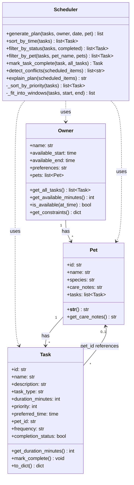

# PawPal+ Class Diagram

Mermaid.js class diagram for the pet care app (Owner, Pet, Task, Scheduler).



## How to view

- **GitHub / GitLab**: Paste the mermaid block into a `.md` file; it will render in the repo.
- **VS Code / Cursor**: Use a Mermaid preview extension (e.g. "Markdown Preview Mermaid Support").
- **Online**: Copy the diagram code into [Mermaid Live Editor](https://mermaid.live).
- **CLI (PNG/SVG)**: Install `@mermaid-js/mermaid-cli` then run:
  ```bash
  mmdc -i class-diagram.md -o diagram.svg
  ```
  (Use a `.mmd` file containing only the mermaid code if the CLI doesn't accept `.md`.)
